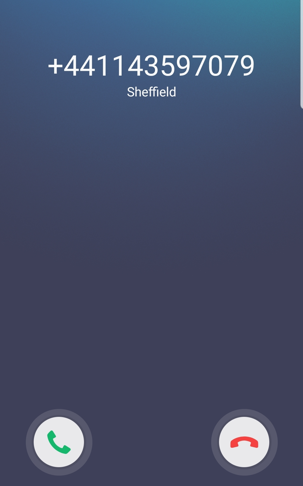

# How to Set up PagerDuty Alerts in Grafana

In my previous guide [“Monitoring NEAR Node with Prometheus and Grafana”](https://github.com/masknetgoal634/near-prometheus-exporter/blob/master/guide/GUIDE.md), I showed how to set up Prometheus and Grafana and how to send email notifications (Gmail). In this guide, I’d like to share how to set up alert notifications for PagerDuty in Grafana.

## PagerDuty

PagerDuty is one of the most well-known incident response platforms for IT departments. To set up alerting through PagerDuty, you need to [create an account](https://www.pagerduty.com/sign-up/) there. (PagerDuty is a paid service, but you can always do a 14-day free trial.) Once you’re logged in, go to Configuration -> Services -> + New  Service.

Add a new service:

Choose Prometheus from the Integration types list and give the service a name – type a name for example "Grafana". (You can also customize the incident settings, but I went with the default setup.) Then click save.

The Integration Key will be displayed. Copy the key.

In PagerDuty user settings, you can decide how you’d like to be notified: email and/or phone call/sms. I chose all and they each worked successfully.

By default international phone alerts not allowed you need to click on "request" hyperlink to request permission for such calls/sms.

In a few hours you should be able to access international phone alerts.

## Grafana

### Add a notification channel

In the Grafana side bar, hover your cursor over the Alerting (bell) icon and then click Notification channels, click "Add channel" type channel name and choose "PagerDuty".

Insert the integration key for the PagerDuty service you have created.

### Add or edit an alert rule

Navigate to the panel you want to add or edit an alert rule for, click the title, and then click Edit. On the Alert tab, click Create Alert. If an alert already exists for this panel, then you can just edit the fields on the Alert tab. Finally add PagerDuty notification channel that we just have created.

You can test the rule or test from the PagerDuty notification channel and you will receive an email, sms and phone call from PagerDuty.

Email:

SMS:

Phone Call:

